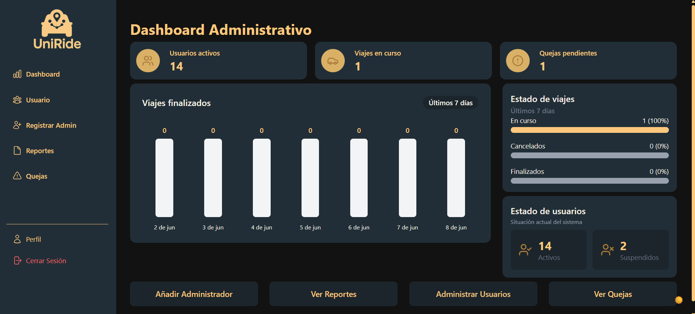
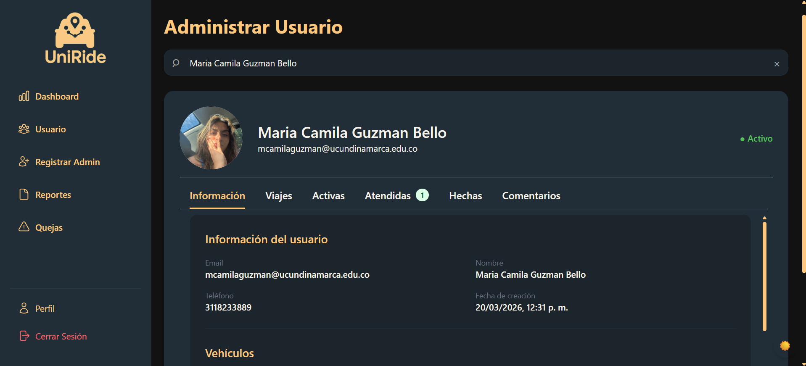
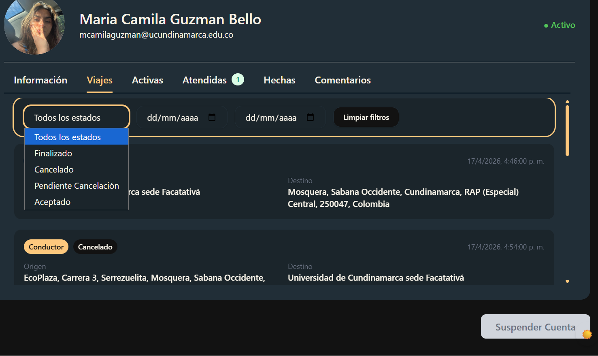
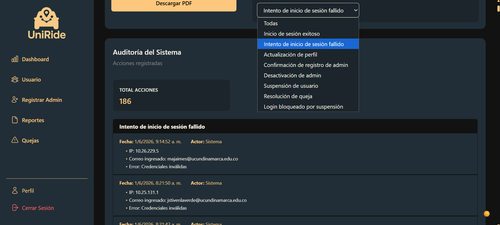
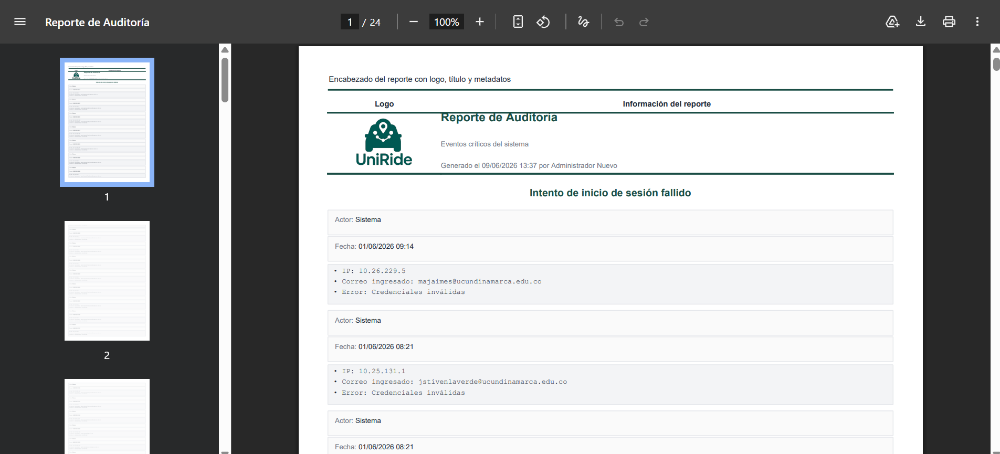
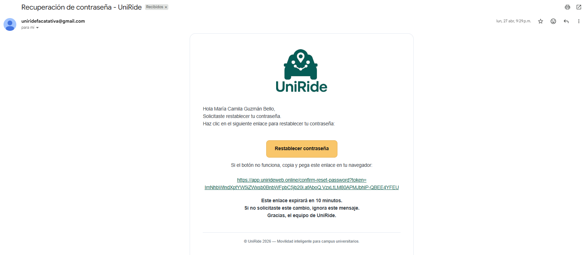
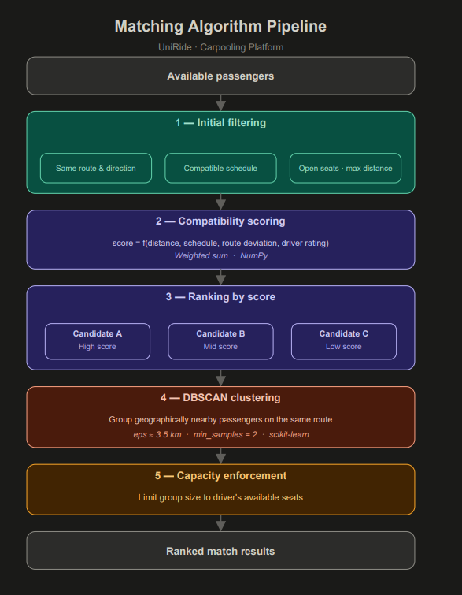

# UniRide Backend

## Overview

UniRide is a collaborative mobility platform designed to connect drivers and passengers within the university community in a safe, efficient, and user-friendly way.

This repository contains the backend of the application, developed with Django and Django REST Framework, providing a scalable REST API architecture for user management, trip management, authentication, ratings, complaints, notifications, reporting, email services, and administrative operations.

## My Contributions

* Developed the complete administrative dashboard.
* Designed and implemented the intelligent matching system between drivers and passengers.
* Implemented JWT-based authentication and authorization.
* Developed the audit logging system.
* Implemented user management and role-based access control.
* Developed reporting and analytics features.
* Implemented email notification services.
* Designed and documented REST APIs using Django REST Framework and Swagger.
* Contributed to system security, validation rules, and backend architecture.

## Technologies

* Python
* Django
* Django REST Framework
* MySQL
* JWT Authentication
* Swagger / OpenAPI
* Git & GitHub
* Scrum Methodology

## Getting Started

### Clone the repository

```bash
git clone https://github.com/camiguzmanbello/uniride-backend.git
```

### Create a virtual environment

```bash
python -m venv env
```

### Activate the virtual environment

Windows:

```bash
env\Scripts\activate
```

### Install dependencies

```bash
pip install -r requirements.txt
```

### Run migrations

```bash
python manage.py migrate
```

### Start the development server

```bash
python manage.py runserver
```

## Screenshots

### Administrative Dashboard



### User Management



### Trip Management



### Audit Logs



### Reports and Analytics



### Email Notifications



### Intelligent Matching System



## Features

* User Registration and Authentication
* JWT Authentication
* Role-Based Authorization
* Trip Management
* Intelligent Driver-Passenger Matching
* Ratings and Reviews
* Complaint Management
* Administrative Dashboard
* Audit Logging
* Reporting and Analytics
* Email Notifications
* REST API Documentation

## Project Status

Completed academic project with continuous improvements and maintenance.
